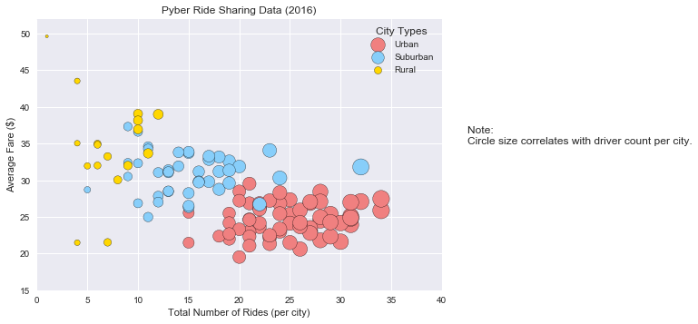
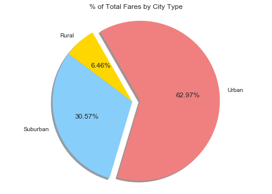
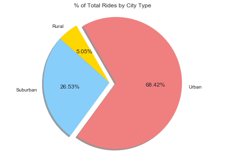
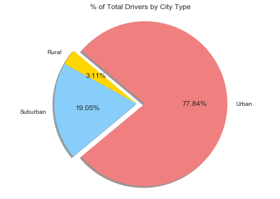

# Pyber Ride Sharing

## Analysis
#### Observed Trend 1: Rural areas tend to have higher rates with less rides compared to Urban areas that have cheaper fares, but more Pyber traffic.

#### Observed Trend 2:  Despite having cheapest fares, Urban areas still yield over 75% of the total Pyber cash.

#### Observed Trend 3: Urban and Suburban fares are more consistent city to city while Rural areas are stratified.


```python
# import dependencies
import matplotlib.pyplot as plt
import numpy as np
import pandas as pd
import seaborn as sb
```


```python
# read csv files

ride_data = "ride_data.csv"
ride_data = pd.read_csv(ride_data)

city_data = "city_data.csv"
city_data = pd.read_csv(city_data)
city_data.city.drop_duplicates(inplace=True)

# merge csv files
city_and_ride_data = pd.merge(ride_data, city_data, how='outer',on="city")

city_and_ride_data.head()
```


<div>
<style>
    .dataframe thead tr:only-child th {
        text-align: right;
    }

    .dataframe thead th {
        text-align: left;
    }

    .dataframe tbody tr th {
        vertical-align: top;
    }
</style>
<table border="1" class="dataframe">
  <thead>
    <tr style="text-align: right;">
      <th></th>
      <th>city</th>
      <th>date</th>
      <th>fare</th>
      <th>ride_id</th>
      <th>driver_count</th>
      <th>type</th>
    </tr>
  </thead>
  <tbody>
    <tr>
      <th>0</th>
      <td>Sarabury</td>
      <td>2016-01-16 13:49:27</td>
      <td>38.35</td>
      <td>5403689035038</td>
      <td>46</td>
      <td>Urban</td>
    </tr>
    <tr>
      <th>1</th>
      <td>Sarabury</td>
      <td>2016-07-23 07:42:44</td>
      <td>21.76</td>
      <td>7546681945283</td>
      <td>46</td>
      <td>Urban</td>
    </tr>
    <tr>
      <th>2</th>
      <td>Sarabury</td>
      <td>2016-04-02 04:32:25</td>
      <td>38.03</td>
      <td>4932495851866</td>
      <td>46</td>
      <td>Urban</td>
    </tr>
    <tr>
      <th>3</th>
      <td>Sarabury</td>
      <td>2016-06-23 05:03:41</td>
      <td>26.82</td>
      <td>6711035373406</td>
      <td>46</td>
      <td>Urban</td>
    </tr>
    <tr>
      <th>4</th>
      <td>Sarabury</td>
      <td>2016-09-30 12:48:34</td>
      <td>30.30</td>
      <td>6388737278232</td>
      <td>46</td>
      <td>Urban</td>
    </tr>
  </tbody>
</table>
</div>


# Bubble Plot of Ride Sharing Data


```python
Urban = city_and_ride_data[(city_and_ride_data.type == "Urban")]
Suburban = city_and_ride_data[(city_and_ride_data.type == "Suburban")]
Rural = city_and_ride_data[(city_and_ride_data.type == "Rural")]

Urban_rides_per_city = Urban.groupby([city_and_ride_data.city]).count()["ride_id"]
Urban_average_fare = Urban.groupby([city_and_ride_data.city]).mean()["fare"]

Suburban_rides_per_city = Suburban.groupby([city_and_ride_data.city]).count()["ride_id"]
Suburban_average_fare = Suburban.groupby([city_and_ride_data.city]).mean()["fare"]

Rural_rides_per_city = Rural.groupby([city_and_ride_data.city]).count()["ride_id"]
Rural_average_fare = Rural.groupby([city_and_ride_data.city]).mean()["fare"]

plt.scatter(Urban_rides_per_city, Urban_average_fare, label = "Urban", s=Urban_rides_per_city*10, marker="o", c=["lightcoral"], edgecolors="black")
plt.scatter(Suburban_rides_per_city, Suburban_average_fare, label = "Suburban",s=Suburban_rides_per_city*10, marker="o", c=["lightskyblue"], edgecolors="black")
plt.scatter(Rural_rides_per_city, Rural_average_fare, label = "Rural", s=Rural_rides_per_city*10, marker="o", c=["gold"], edgecolors="black")

# Plot field size
plt.xlim(0, 40)
plt.ylim(15,52)

# Create a title, x label, and y label for plot
plt.title("Pyber Ride Sharing Data (2016)")
plt.xlabel("Total Number of Rides (per city)")
plt.ylabel("Average Fare ($)")

plt.legend(title="City Types")

plt.annotate("Note: \nCircle size correlates with driver count per city.", xy=(30, 30), xycoords='data',xytext=(42.5, 35),)
            
            
plt.grid(c="white")

plt.show()
```





# Total Fares by City Type


```python
#Define Axis

#X axis
Total_rides_per_city_Fare = city_and_ride_data.groupby(["type"])[["fare"]].sum()

# Format plot
plt.pie(Total_rides_per_city_Fare, 
        explode=[0,0,.1], 
        labels=["Rural","Suburban","Urban"], 
        colors=["gold","lightskyblue", "lightcoral"], 
        autopct= '%.2f%%',
        pctdistance=.6, 
        shadow=True, 
        startangle=120)

# Create a title, x label, and y label for plot
plt.title("% of Total Fares by City Type")
plt.axis("equal")
plt.show()
```





# Total Rides by City Type


```python
#Define Axis

#X axis
Total_Rides_by_City_Type = city_and_ride_data.groupby(["type"])[["ride_id"]].count()

# Format plot
plt.pie(Total_Rides_by_City_Type, 
        explode=[0,0,.1], 
        labels=["Rural","Suburban","Urban"], 
        colors=["gold","lightskyblue", "lightcoral"], 
        autopct= '%.2f%%',
        pctdistance=.6, 
        shadow=True, 
        startangle=120)

# Create a title, x label, and y label for plot
plt.title("% of Total Rides by City Type")
plt.axis("equal")
plt.show()
```





# Total Drivers by City Type


```python
#Define Axis
#city_data.type
#X axis
Total_Drivers_by_City_Type = city_data.groupby(["type"])[["driver_count"]].sum()

# Format plot
plt.pie(Total_Drivers_by_City_Type, 
        explode=[0,0,.1], 
        labels=["Rural","Suburban","Urban"], 
        colors=["gold","lightskyblue", "lightcoral"], 
        autopct= '%.2f%%',
        pctdistance=.6, 
        shadow=True, 
        startangle=140)

# Create a title, x label, and y label for plot
plt.title("% of Total Drivers by City Type")
plt.axis("equal")
plt.show()
```




